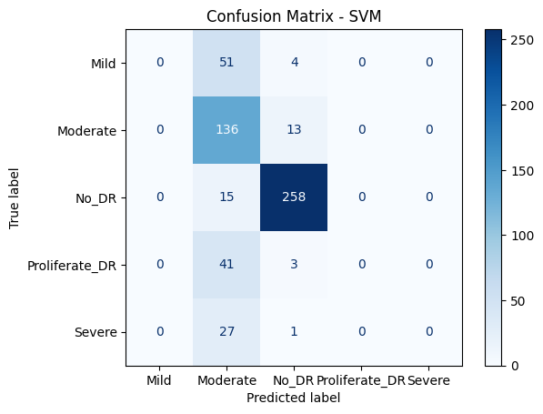

# **CLASSIFICATION of Diabetic Retinopathy using CUSTOM CNN and TRANSFER LEARNING**

The diagnosis of diabetic retinopathy (DR) through colour fundus images requires experienced clinicians to identify the presence and significance of many small features which, along with a complex grading system, makes this a difficult and time consuming task. The solution is to automate the classification using Ai based tools with proposed solution as follow.

- [x] We will use custom CNN to first extract the features using a 6 layer dense network.
- [x] Use the output features as input to machine learning classifer like SVM and Random Forest.  
- [x] Use different parameters like specificity, precission, recall, acuracy etc to assess the model performance.

### The CNN architecture (sustom )

| Layer Number | Layer Type         | Filter/Units | Kernel Size | Activation | Output Shape (Approx) | Notes                       |
| ------------ | ------------------ | ------------ | ----------- | ---------- | --------------------- | --------------------------- |
| 1            | Conv2D             | 64           | (5, 5)      | ReLU       | (224, 224, 64)        | Input shape (224,224,3)     |
| 2            | MaxPooling2D       | -            | (2, 2)      | -          | (112, 112, 64)        |                             |
| 3            | Conv2D             | 64           | (5, 5)      | ReLU       | (112, 112, 64)        |                             |
| 4            | MaxPooling2D       | -            | (2, 2)      | -          | (56, 56, 64)          |                             |
| 5            | Conv2D             | 128          | (5, 5)      | ReLU       | (56, 56, 128)         |                             |
| 6            | MaxPooling2D       | -            | (2, 2)      | -          | (28, 28, 128)         |                             |
| 7            | Conv2D             | 256          | (3, 3)      | ReLU       | (28, 28, 256)         |                             |
| 8            | MaxPooling2D       | -            | (2, 2)      | -          | (14, 14, 256)         |                             |
| 9            | Conv2D             | 512          | (3, 3)      | ReLU       | (14, 14, 512)         |                             |
| 10           | MaxPooling2D       | -            | (2, 2)      | -          | (7, 7, 512)           |                             |
| 11           | Conv2D             | 1024         | (1, 1)      | ReLU       | (7, 7, 1024)          |                             |
| 12           | MaxPooling2D       | -            | (2, 2)      | -          | (3, 3, 1024)          |                             |
| 13           | GlobalMaxPooling2D | -            | -           | -          | (1024,)               | Converts to 1D vector       |
| 14           | Dense              | 1024         | -           | ReLU       | (1024,)               | Fully connected layer       |
| 15           | Dropout            | -            | -           | -          | (1024,)               | Dropout with rate 0.5       |
| 16           | Dense (Output)     | num\_classes | -           | Softmax    | (num\_classes,)       | Output classification layer |

### Results and inter pretations

|  | Support vector Machine | Random Forest |
| --- | ------------ | ------------ |
| Accuracy | 71.8% | 72.0% |
| Precision | 59.7% | 67.5% |
| Sensitivity | 71.7% | 72.05% |
| Specificity | 92.2% | 91.7% |
| F1 Score |64.1% | 68.1% |
 Confussion Matrix |  |  |

## Conclusion 

With custom CNN of 6 layers and classification using  SVM and Random forest we can predict with 71% accuracy.
