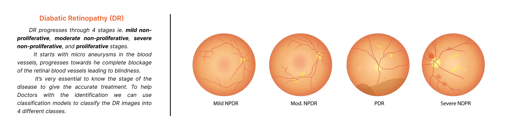

# **CLASSIFICATION of Diabetic Retinopathy using CUSTOM CNN and TRANSFER LEARNING**

The diagnosis of diabetic retinopathy (DR) through colour fundus images requires experienced clinicians to identify the presence and significance of many small features which, along with a complex grading system, makes this a difficult and time consuming task. The solution is to automate the classification using Ai based tools with proposed solution as follow.

- [x] We will use custom CNN to first extract the features using a 6 layer dense network.
- [x] Use the output features as input to machine learning classifer like SVM and Random Forest.  
- [x] Use different parameters like specificity, precission, recall, acuracy etc to assess the model performance.

